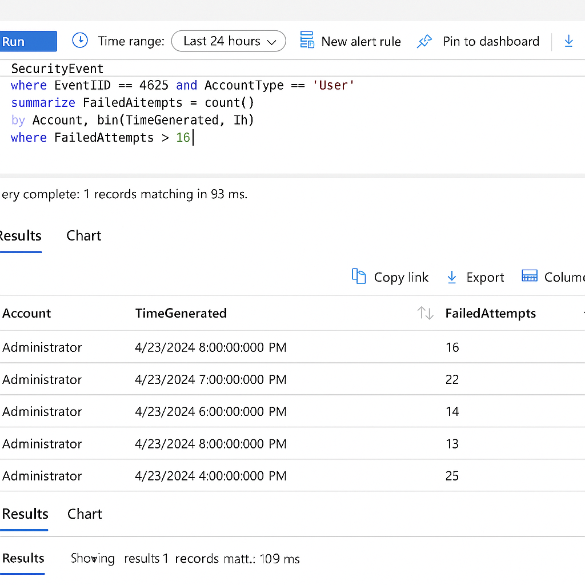

# 🔍 SOC Analyst Case Study – MITRE ATT&CK Detection

## 🎯 Objective
Demonstrate how a SOC Analyst can detect and respond to real-world threats using MITRE ATT&CK and Microsoft Sentinel.

## 🛠️ Tools Used
- Microsoft Sentinel
- MITRE ATT&CK Framework
- Sysmon
- Azure Log Analytics

## 📌 Scenario
Simulated a brute-force attack targeting RDP and mapped it to ATT&CK technique `T1110.001`.

## 🔎 Detection Logic
Created KQL detection rule:
```kql
SecurityEvent
| where EventID == 4625 and AccountType == "User"
| summarize FailedAttempts = count() by Account, bin(TimeGenerated, 1h)
| where FailedAttempts > 10

✅ Outcome
Alert generated
Investigation triggered
Incident escalated

## 📸 Sentinel Alert Visualization

This screenshot shows a brute-force login detection alert generated using custom KQL in Microsoft Sentinel.




